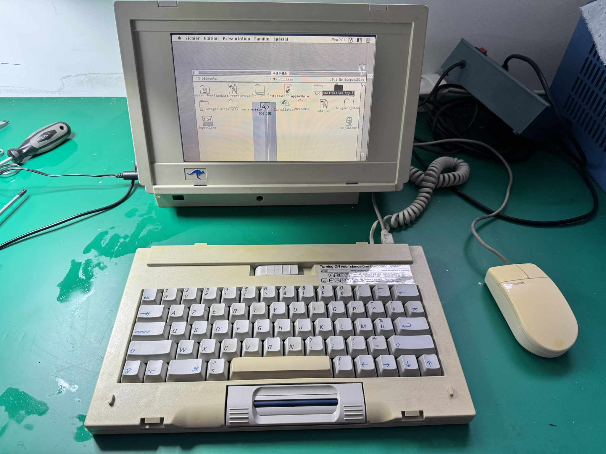
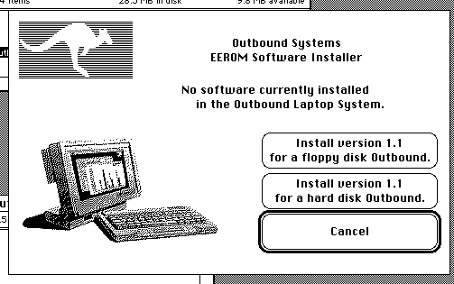

# outbound
Documentation of the Outbound Mac Clone

## Outbound Wallaby Model 125

Serial: 3000002 (French Keyboard)

## Documentation

In [docs](docs) there are the known Outbound 125 documentation, including the readme of the 1.1 version of the Software.

## roms

The [roms directory](roms) contains dumps of the outbound roms u40 and u49.

## images

Some [images of the machine](images). Public domain.

## Software

This contains a folder found on an Outbound, with the 1.1 version of the software.

[Read me](docs/Outbound-125-READ_ME_NOW_1.1.txt)
